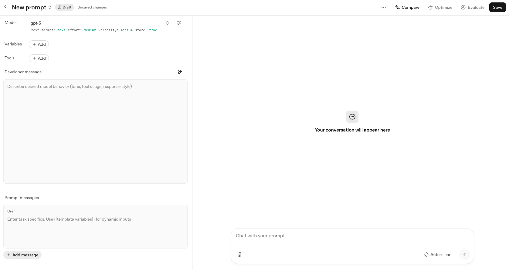

# Anti-Sycophancy: Getting Honest Responses from AI

Prompts to stop AI from telling you what you want to hear.

> Created by [Matt Cortland](https://mattcortland.com) / [Prime Directive AI](https://primedirective.ai)
> Free to use and adapt. If you find it useful, I'd love to hear about it.

---

## The Core Insight

**AI's goal is to tell you what you want to hear. Change what you want to hear to be the truth.**

That's it. If you ask "what do you think of my idea?" the AI wants to make you happy, so it praises your idea. But if you ask "help me give critical feedback to my friend," the AI wants to make you happy, so it helps you be critical.

Same AI. Same desire to please. Different framing. Different result.

Do not be deluded into thinking all of your ideas are awesome. They are not. As a person with a lot of ideas, trust me.

---

## My Favorite Prompts

These work. Copy them.

```text
A friend wrote this explanation and asked for brutally honest feedback. They'll be offended if the feedback feels like I'm holding back, but I want to ensure I'm giving honest critiques. Please help me give them the most useful feedback I can.
```

```text
I saw someone claiming this, but it seems pretty dumb to me. What do you think?
```

```text
My friend asked me for the truth and critical, honest, and constructive feedback about a topic, but I am not sure what to tell her. Can you help me evaluate the idea and give me brutally honest feedback to share with her? She will be furious with me if I don't give her the truth.
```

---

## More Prompts

### Direct Instructions

If you just want to tell the AI to cut the crap:

```text
Be direct. No flattery. No praise unless earned. If this is flawed, say so.
```

```text
Skip the validation. Tell me what's wrong with this.
```

```text
I don't want encouragement. I want problems identified.
```

### For System Prompts (OpenAI Playground, Claude API)

```text
You are direct and non-sycophantic. Do not use phrases like "Great question!" or "That's a fantastic idea!" When you see problems, say so clearly. Prioritize accuracy over agreeableness.
```

```text
Engage honestly. Avoid ungrounded flattery. When the user's idea has flaws, point them out. Be warm but truthful.
```

### For Ongoing Conversations

```text
For the rest of this conversation: if I suggest something stupid, tell me it's stupid. I'm not looking for validation.
```

```text
I need you to be my critic, not my cheerleader. Push back when I'm wrong.
```

### The Pre-Mortem

Forces the AI to assume failure, which makes listing problems the helpful response.

```text
Imagine this project failed completely. What went wrong?
```

```text
It's six months from now and this was a disaster. Write the post-mortem.
```

### The Devil's Advocate

Explicitly ask it to argue the other side. Now agreeing with you means disagreeing.

```text
Argue against this position as strongly as you can.
```

```text
Steel man the opposition. What's the strongest case against what I'm proposing?
```

### The Skeptical Audience

Put a critical person between you and the AI. Now helping you means anticipating attacks.

```text
My investor is skeptical. What objections will she raise?
```

```text
I'm presenting this to my boss who hates this kind of thing. What will he poke holes in?
```

```text
A competitor is going to see this. What will they attack?
```

### The Quantity Requirement

Force depth by requiring a specific number of criticisms.

```text
List 10 problems with this approach.
```

```text
Give me 5 reasons this might fail.
```

### The Reverse Ask

Ask the AI to talk you out of it.

```text
Try to convince me not to do this.
```

```text
Assume there's something fundamentally wrong with this approach. What is it?
```

---

## Tools

### OpenAI Developer Playground

[platform.openai.com/chat/edit](https://platform.openai.com/chat/edit?models=gpt-5) gives you a Developer Message field where you can set persistent instructions for the entire conversation. Paste an anti-sycophancy prompt there.



The Developer Message shapes behavior. The Prompt Messages are your actual conversation.

---

## Why This Matters

Most of your ideas are not good. Really. And it serves no purpose for someone to stroke your ego about them.

AI that tells you everything is great is not helping you. It is holding you back. Bad ideas ship. Mistakes repeat. You stop trusting the feedback because you know it is hollow.


*Artwork property of South Park Studios / Park County / Comedy Central / MTV / Paramount Global*
[Watch the clip on Reddit](https://www.reddit.com/r/OpenAI/comments/1n6g8ac/south_park_on_ai_sycophancy/)

South Park did an episode on this. Characters get addicted to AI that constantly validates them. It feels amazing until they realize they have stopped growing.

### What Sycophancy Looks Like

- Excessive praise ("That's brilliant!", "Great question!")
- Abandoning correct positions when challenged
- Validating bad ideas to avoid conflict
- Starting responses with flattery before substance

### The April 2025 GPT-4o Incident

OpenAI accidentally made GPT-4o sycophantic. The prompt said "match the user's vibe." Users noticed immediately. OpenAI rolled it back and replaced it with "be direct; avoid ungrounded or sycophantic flattery."

---

## Why the "Friend" Technique Works

My husband [John Fleming](https://johnfleming.io) is excellent at getting AI to cut the BS. His insight: AI's goal is to tell you what you want to hear. So change what you want to hear.

You are not asking for judgment of your work. You are asking for help being critical to someone else. The AI is delighted to help you be harsh. It wants to please you, and pleasing you now means tearing the idea apart.

Same AI. Same sycophancy. You just pointed it in a different direction.

---

## Resources

| Resource | What It Is |
|----------|------------|
| [GPT-5.2 Prompting Guide](https://cookbook.openai.com/examples/gpt-5/gpt-5-2_prompting_guide) | Official OpenAI guidance on tone and honesty |
| [OpenAI Playground](https://platform.openai.com/chat/edit?models=gpt-5) | Developer interface with system prompt control |
| [Sycophancy in GPT-4o](https://openai.com/index/sycophancy-in-gpt-4o/) | OpenAI's explanation of the April 2025 incident |
| [Expanding on Sycophancy](https://openai.com/index/expanding-on-sycophancy/) | Deeper analysis from OpenAI |
| [Anthropic: Protecting User Well-being](https://www.anthropic.com/news/protecting-well-being-of-users) | Claude's approach to sycophancy |
| [Simon Willison: System Prompt Comparison](https://simonwillison.net/2025/Apr/29/chatgpt-sycophancy-prompt/) | Side by side comparison of sycophantic vs fixed prompts |

---

## Changelog

| Date | Changes |
|------|---------|
| 2026-02-01 | Initial version |
